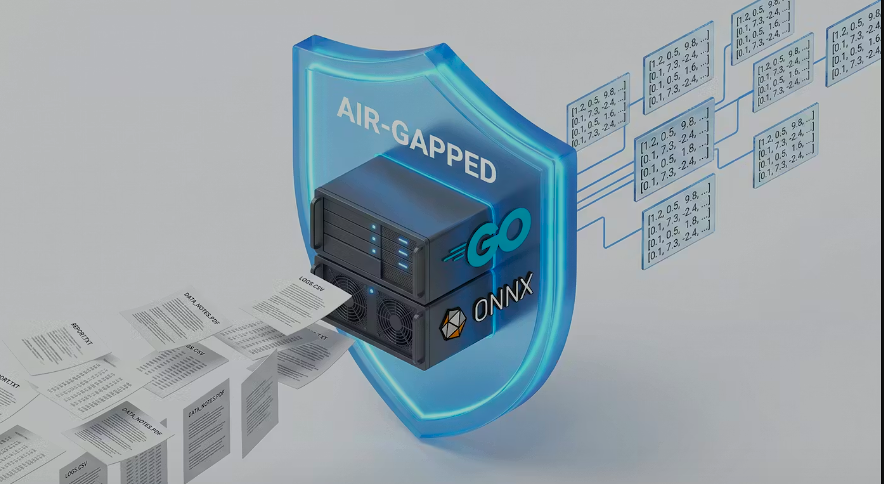

<p align="center">
  
</p>

# mlc-localembed v1.0.2

[](https://golang.org)
[](https://opensource.org/licenses/MIT)
[](#motivation)

LocalEmbed is a high-performance Go-based service for generating text embeddings using ONNX Runtime. It provides an Ollama-compatible API for easy integration into existing AI workflows.

## Cross-Platform Support

LocalEmbed is designed to run virtually anywhere:
- **macOS**: Native support for Apple Silicon (M1, M2, M3, M4, M5) and Intel Macs.
- **Windows**: Full support with a dedicated System Tray application for easy management.
- **Linux**: Tested on Ubuntu Server (x64), but compatible with most modern distributions.

## Hardware & Performance

### CPU-First Strategy
By default, LocalEmbed uses **CPU power only**. For most embedding models (like BGE or E5), modern CPUs are more than fast enough to provide sub-millisecond latency. This allows the service to run on almost any hardware—from modern MacBooks to "retired" servers or affordable mini-PCs—without the need for expensive GPUs or complex driver setups.

### Optional GPU Acceleration
While CPU is the default, GPU acceleration (CUDA, CoreML, DirectML) can be enabled via `config.yaml` or command-line flags if your hardware supports it.

## User Interface (GUI)

On **Windows** and **macOS**, LocalEmbed includes a lightweight **System Tray Application**. 
- **Easy Management**: Start and stop the server with a single click from your taskbar/menubar.
- **Status Monitoring**: See at a glance if the API is online (🟢) or offline (🔴).
- **Integrated Tools**: Quick access to server logs and the model preloader.

## Validation & Accuracy

A core milestone for **v1.0.0** was achieving mathematical parity with [Ollama](https://ollama.com/). Using our internal comparison tool (`tests/integration/compare_ollama.go`), we verified that the embeddings generated by `mlc-localembed` are virtually identical to those produced by Ollama for supported models.

### Results (Cosine Similarity)
| Model | Similarity vs Ollama | Status |
|-------|----------------------|--------|
| `nomic-embed-text` | **1.000000** | ✅ Identical |
| `all-minilm` | **0.999999** | ✅ Identical |

These results confirm that our implementation of special token handling (`[CLS]`, `[SEP]`), pooling strategies, and normalization is correct and reliable for production use.

## Motivation
...

The primary goal of LocalEmbed is to provide a **cost-effective and efficient infrastructure** for AI applications. While powerful services like Ollama or commercial APIs are excellent for running large language models (LLMs) like Gemma, Llama, or GPT-4, using them for high-volume embedding tasks can be expensive or introduce unnecessary latency.

We use this tool internally for **RAG (Retrieval-Augmented Generation)** workflows. In RAG, documents must be embedded and indexed frequently to provide context to the LLM. By handling embeddings locally:
- **Golang over Python**: Most embedding libraries are Python-based, which often leads to "dependency hell" (version conflicts, virtual environment management, large container images). Go allows us to distribute a single, high-performance binary with minimal external dependencies.
- **Cost Savings**: No per-token costs for embedding large datasets for indexing.
- **Efficiency**: Optimized ONNX execution is often faster for small embedding models than general-purpose LLM runners.
- **Separation of Concerns**: Keep your "heavy" LLM processing separate from your "high-frequency" embedding tasks.
- **CPU-First Strategy**: We intentionally focus on CPU execution. While GPU support could be added, using CPUs allows the service to run on almost any hardware—from modern M1/M2 chips to "retired" servers or affordable mini-PCs—without the need for expensive GPUs or complex driver setups.

This should not be a problem on modern hardware (e.g. M1 etc) - but be warned, older CPUs might cause problems for some models.

## Features

- **Fast & Lightweight**: Built with Go and ONNX Runtime for minimal overhead.
- **Ollama & OpenAI Compatible**: Supports `/api/embed` (Ollama) and `/api/embeddings` (OpenAI/Legacy Ollama) endpoints.
- **Configurable**: Easily manage models and runtime settings via YAML.
- **Resource Management**: Built-in protection for multi-core systems (Xeon freeze protection).
- **Network Isolation**: 100% air-gapped runtime once models are preloaded.
- **Monitoring**: Built-in statistics and health endpoints for production usage.

## Installation Layout (Standard Paths)

To provide a clean system integration, the application follows these platform-specific conventions:

| Component | Linux (RPM) | macOS (Installer) | Windows (Portable) |
| :--- | :--- | :--- | :--- |
| **Binaries** | `/usr/bin/mlcembedder` | `/usr/local/bin/` | `C:\Program Files\LocalEmbed\` |
| **Configuration** | `/etc/localembed/config.yaml` | `/usr/local/etc/localembed/` | `C:\ProgramData\LocalEmbed\config.yaml` |
| **Models Cache** | `/var/lib/localembed/mlcembed` | `~/Library/Application Support/localembed/models` | `C:\ProgramData\LocalEmbed\models` |
| **ONNX Library** | `/usr/lib64/localembed/` | `/usr/local/lib/` | Application directory |

The server automatically looks for the configuration file in these locations if no `-config` flag is provided.

## Configuration

Settings are managed via `config.yaml` or environment variables (which take precedence).

### Environment Variables

| Variable | Description | Default |
|----------|-------------|---------|
| `MLC_PORT` | Server port | `9142` |
| `MLC_LOG_LEVEL` | Log level (`info`, `debug`) | `info` |
| `MLC_MAX_CONCURRENCY` | Global concurrent request limit | `4` |
| `MLC_LRU_CACHE` | Embedding cache size (items) | `10` |
| `MLC_CACHE_DIR` | Path to model cache | `./mlcembed` |
| `MLC_INTRA_THREADS` | ONNX intra-op threads | From config |
| `MLC_INTER_THREADS` | ONNX inter-op threads | From config |
| `MLC_DEFAULT_MODEL` | Default model name | From config |

### config.yaml

```yaml
server:
  port: 9142
  log_level: "info"
  max_concurrency: 4
  lru_cache_size: 10 # Cache generated embeddings (0 to disable)

storage:
  cache_dir: "./mlcembed"
  allow_offline_download: true

onnx:
  intra_op_num_threads: 4 # Limit threads to prevent system freezes
  inter_op_num_threads: 4

migration:
  data_dir: "./docs"
  embeddings_dir: "./embeddings"
  auto_migrate: true

models:
  default: "multilingual-e5-small"
  available:
    - name: "multilingual-e5-small"
      enabled: true
    - name: "nomic-ai/nomic-embed-text-v1.5"
      enabled: true
    - name: "Xenova/bge-small-en-v1.5"
      enabled: true
    - name: "all-minilm"
      enabled: true
    - name: "BAAI/bge-small-en-v1.5"
      enabled: false # Disabled by default due to Intel VNNI instruction requirements
```

> **Note**: I am currently only testing with the models listed above. If you discover other models that work well with this infrastructure, please let me know! I would be happy to include them in the default configuration.

### Technical Notes

- **Xeon Freeze Protection**: On some high-core systems (like Xeon processors), ONNX Runtime may attempt to use all available cores, causing system instability. We limit `intra_op_num_threads` by default to ensure stable operation.
- **Intel VNNI Support**: Some optimized models require the Intel VNNI instruction set. If your CPU does not support this (e.g., older processors or non-Intel CPUs), certain models may fail or perform poorly. These models are disabled by default. When testing I even brought my xeon server down (which had no support for this)

## Usage

The project includes three main tools in the `bin/` directory:

### 1. Preloader (`bin/preloader`)
Downloads and prepares models from Hugging Face based on your `config.yaml`.
```bash
# Optional: Provide Hugging Face token for restricted models
export HF_TOKEN=your_token_here
./bin/preloader
```

### 2. Server (`bin/server`)
Starts the Ollama-compatible API server.
```bash
./bin/mlcembedder
```
The server will be available at `http://localhost:9142` (default).

> **Ollama Drop-in Replacement**: To use this as a replacement for Ollama's embedding service in existing tools, you can either change your tool's configuration to port `9142` or set `MLC_PORT=11434` (Ollama's default port) before starting the server.

### 3. CLI Tool (`bin/cli`)
A simple tool to test embeddings directly from the command line.
```bash
./bin/cli -text "Your text here" -model "multilingual-e5-small"
```

## API Endpoints

- `POST /api/embed`: Generate embeddings for one or more strings (Modern Ollama compatible).
- `POST /api/embeddings`: **OpenAI & Legacy Ollama compatible** endpoint. It supports the `prompt` field and returns a standard OpenAI-style response format, making it a drop-in replacement for many existing AI tools.
- `POST /api/generate`: Returns `501 Not Implemented`. This server only supports embeddings, but providing this endpoint prevents some clients from crashing.
- `GET /api/tags`: List available and enabled models (Ollama compatible).
- `GET /api/health`: Basic health check (returns version and status).
- `GET /api/stats`: Returns usage statistics (request counts, uptime, average processing time per model).
- `POST /api/test/similarity`: Directly compare a query against multiple documents to get semantic similarity scores.

### Similarity API Example

```bash
curl -X POST http://localhost:9142/api/test/similarity \
  -H "Content-Type: application/json" \
  -d '{
    "model": "multilingual-e5-small",
    "query": "Which city is the capital of France?",
    "documents": ["Paris is the capital.", "Berlin is in Germany.", "The sun is a star."]
  }'
```

## Installation

### Binary Installation (Manual)
1. Download the binary for your platform.
2. Ensure `libonnxruntime.so` (or `.dylib`/`.dll`) is in your library path or next to the binary.
3. Run `./bin/preloader` to download models.
4. Run `./bin/mlcembedder`.

### RPM Installation (Fedora 40+ / RHEL · AlmaLinux · Rocky 10+)
We provide an RPM for Enterprise Linux systems. The package **bundles a default
model** (`multilingual-e5-small`), so the service starts and serves embeddings
**offline, out of the box** — no preload step required.

> **glibc note:** the binaries are built against a modern glibc (≥ 2.39). They
> run on Fedora 40+, RHEL/AlmaLinux/Rocky **10+**, and other recent distros, but
> **not** on RHEL/AlmaLinux/Rocky 9 (glibc 2.34). For EL9, rebuild the binaries
> in an EL9 container.

```bash
# 1. Build the RPM (requires rpm-build + task; the default model must be
#    present on the build host — run `task preload` once if needed).
task rpm

# 2. Install it
sudo dnf install build/rpmbuild/RPMS/x86_64/localembed-*.rpm

# 3. Start and enable the service
sudo systemctl enable --now localembed

# 4. Verify
curl -s http://localhost:9142/api/health
```

**Installing additional models afterwards**

The RPM ships only the default model. To add more, point the preloader at the
installed config and run it as the service user, then restart:

```bash
# Downloads every model listed in /etc/localembed/config.yaml into the cache.
sudo -u localembed localembed-preloader -config /etc/localembed/config.yaml

sudo systemctl restart localembed
```

To **offer** a model via the API it must be `enabled: true` in the
`models.available` list of `/etc/localembed/config.yaml` (then restart the
service). `GET /api/tags` lists what is currently served. The preloader is
non-interactive when run without a TTY; set `HF_TOKEN` for gated repositories.

**RPM Features:**
- **Self-contained**: bundles the default model — works fully offline / air-gapped.
- **Systemd Integration**: runs as a background service (`journalctl -u localembed`).
- **Dedicated User**: runs under the `localembed` service user for better security.
- **Standard Paths**:
  - Binaries: `/usr/bin/mlcembedder` (server), `/usr/bin/localembed-cli`, `/usr/bin/localembed-preloader`
  - Library: `/usr/lib64/localembed/libonnxruntime.so`
  - Config: `/etc/localembed/config.yaml`
  - Models: `/var/lib/localembed/models`
  - Logs: `/var/log/localembed/server.log`

### Native systemd install (Debian / Ubuntu / non-RPM Linux)
For distros without RPM, use the installer script. It copies the prebuilt
binaries, ONNX library, config, and model cache from the repo, creates the
`localembed` service user, installs the systemd unit, and starts the service.

```bash
task build                                   # build bin/ first
sudo bash scripts/install-linux-systemd.sh   # install + start the service
```

### macOS Installation
For macOS, we provide a guided installer script that builds the binaries locally and sets up a background service via `launchd`.

```bash
# Run the guided installer
chmod +x scripts/install.sh
./scripts/install.sh
```

**macOS Security Note (Gatekeeper):**
Since the ONNX Runtime library is downloaded as a pre-compiled binary, macOS might block it. If you see a security warning, you can allow the library manually:
1. Open **System Settings** > **Privacy & Security**.
2. Scroll down to find the blocked library (`libonnxruntime.dylib`) and click **Allow Anyway**.
3. Alternatively, run this command to remove the quarantine flag:
   `xattr -d com.apple.quarantine /usr/local/lib/libonnxruntime.dylib`

**Service Management on macOS:**
- **Start Service**: `launchctl load ~/Library/LaunchAgents/com.localembed.server.plist`
- **Stop Service**: `launchctl unload ~/Library/LaunchAgents/com.localembed.server.plist`
- **View Logs**: `tail -f /usr/local/var/log/localembed.log`

## Testing

The project includes both unit tests and integration tests.

### Unit Tests (Go)
Run all internal tests:
```bash
go test -v ./...
```

### Integration Tests (Bash/Curl)
Requires a running server.
```bash
./tests/run_curl_tests.sh
```

## Support & Consulting

If you need professional support, custom model integrations, or enterprise-grade deployment assistance, feel free to reach out. I offer consulting services for:

- **Performance Optimization**: Tuning for specific server hardware (e.g., high-core Xeon systems).
- **Custom Models**: Integrating and optimizing specialized ONNX embedding models.
- **Enterprise RAG**: Architecture design and integration into your existing RAG workflows.

For support inquiries, please **open a GitHub Issue** or contact me via my **GitHub Profile**.

## Related Projects & Credits

While LocalEmbed is now an independent implementation, it was inspired by and built upon the ideas of other great projects. If you are looking for alternatives or the original libraries that paved the way, check these out:

- [fastembed-go](https://github.com/anush008/fastembed-go) - The original Go implementation that inspired this project.
- [fastembed](https://github.com/qdrant/fastembed) - The highly efficient Python library by Qdrant.
- [onnxruntime-go](https://github.com/yalue/onnxruntime_go) - The essential Go bindings for ONNX.
- [tokenizers](https://github.com/daulet/tokenizers) - Go bindings for Hugging Face tokenizers.

## Acknowledgments

This project is primarily an infrastructure layer built on top of excellent existing work. I am grateful to be able to leverage the following libraries and runtimes:

- [onnxruntime-go](https://github.com/yalue/onnxruntime_go) for high-performance model execution.
- [tokenizers](https://github.com/daulet/tokenizers) for text processing.

LocalEmbed focuses on providing the necessary "glue" (Ollama-compatible API, thread management, and model preloading) to make these tools easily accessible in a server environment.

## License

MIT - Copyright (c) 2026 Michael Lechner
